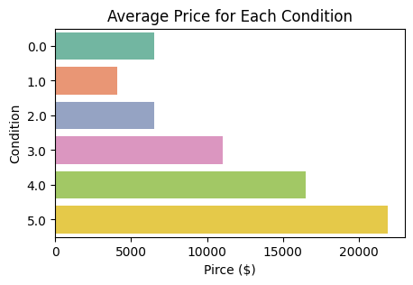
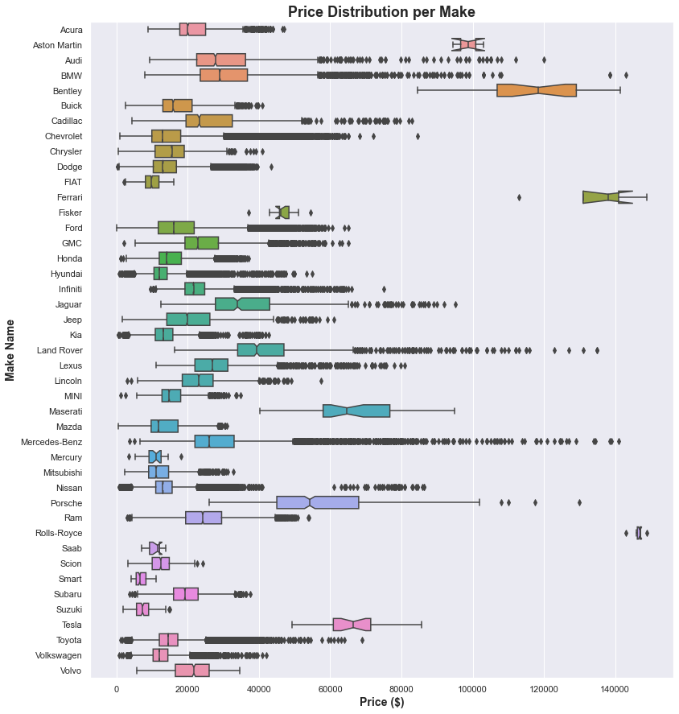
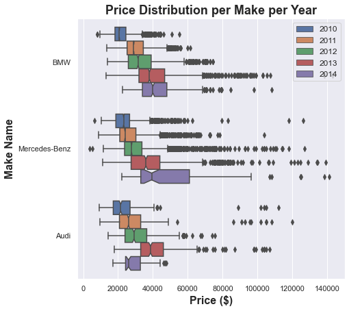
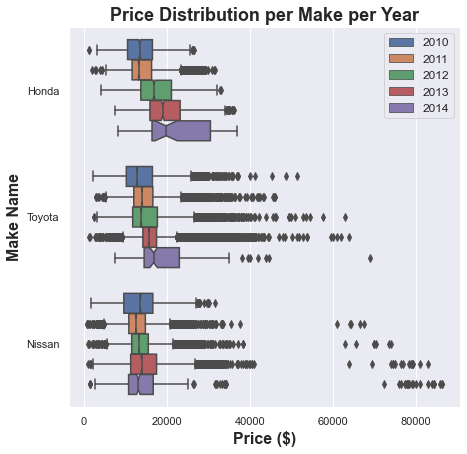
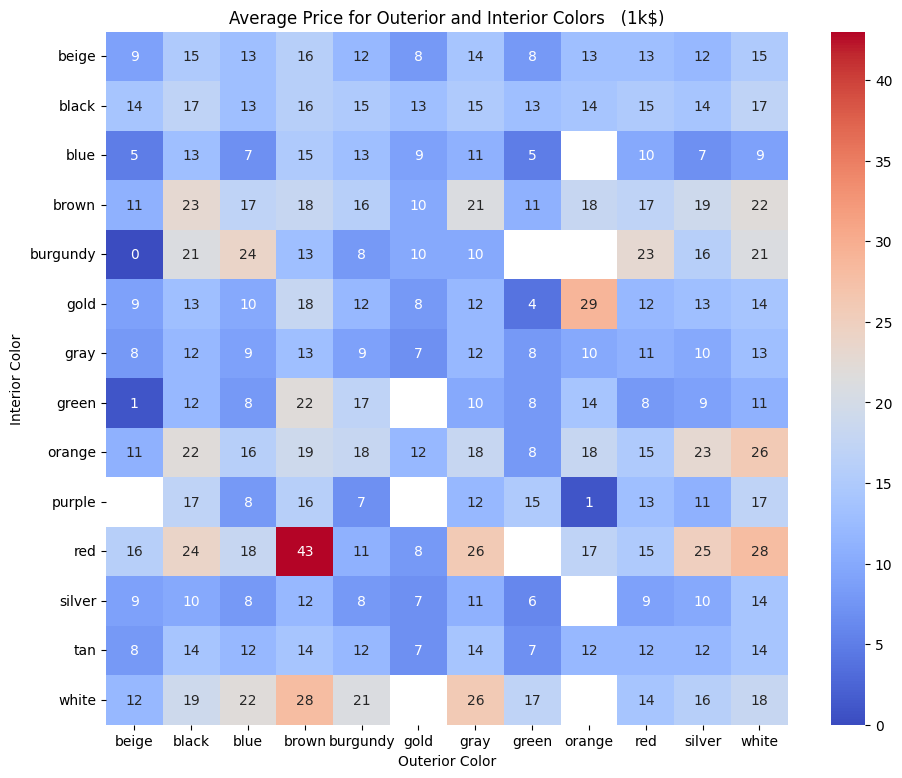
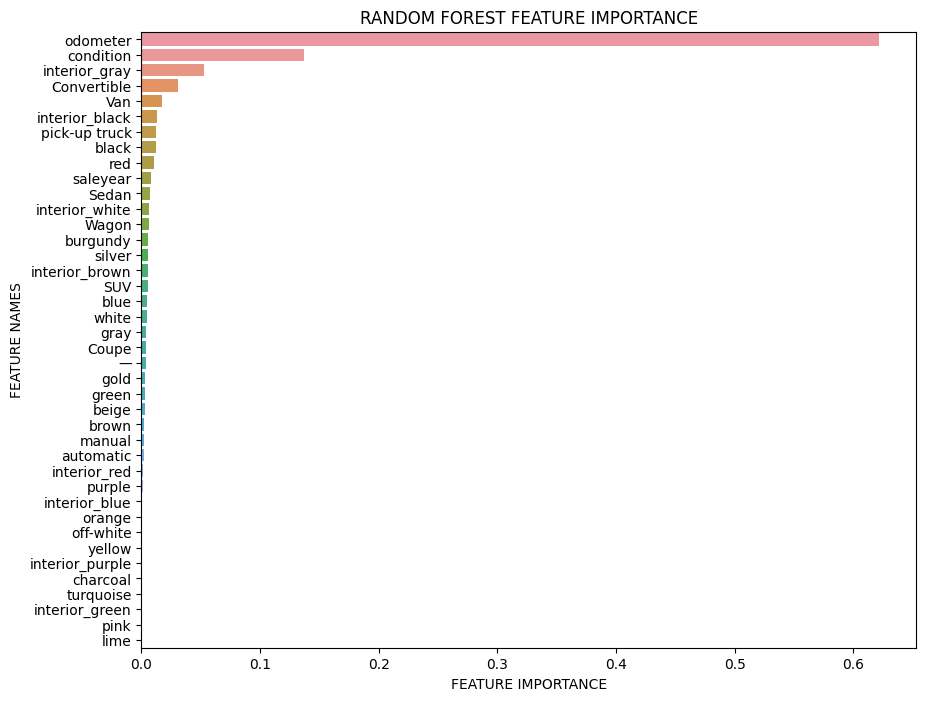

# Used Car data exploration, price analysis, and insight for used luxrury car standard

## Overview

The project focus on finding the features differentiating used cars as economical and luxury. We utilized data from [*Kaggle*](https://www.kaggle.com/datasets/tunguz/used-car-auction-prices), which contains auction information for used cars before 2015. From this dataset, we are able to analyze the features driving people to pay more on buying a used car. The feature we have looked at are: odometer reading, age of the car, condition rating, interior and paint color, and brands. We further chose 4 brands(BMW, Mercedes-Benz, Audi, Infiniti) as luxury group and another 4(Toyota, Nissan, Honda, Kia) as economical group as our machine learning data. In this traning, we want to see except for price, what makes a car outperforms the others.

The main structure of the project is:
- `./data/` contains all data used for analysis and model prediction
  - `./data/raw_data/`: Manually downloaded from Kaggle website
  - `./data/clean_data.csv`: Clean data after dropping the null values, used in analysis part
  - `./data/train_model.csv`: Clean categorized data(luxury 1/ economical 0)used in model training part
- `./picture`: Pictures captured in notebook and exhibited in report
- `./car_price_analysis.ipynb`: Analysis on used car price
- `./Color_Analysis.ipynb`: Analysis on used car price and its relationship with colors
- `./lux_classification.ipynb`: Model prediction notebook with feature importance on making a car luxury

## Analysis Result

## Referrence
